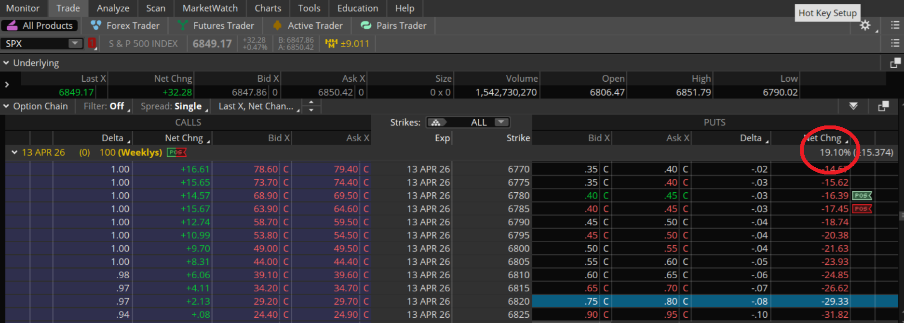

# 0DTE Iron Condor Calculator (Desktop Python)

A native **PySide6** desktop app for planning same-day (0DTE) iron condors on **SPX** and **QQQ**.

No Node.js, no browser app required. Run locally with:

```bash
python app.py
```

## What It Does

- Pulls live Yahoo spot (or use manual spot override)
- Suggests strikes from IV-based expected move
- Shows a Thinkorswim-style 4-leg order preview
- Calculates:
  - net credit
  - max profit / max loss
  - lower and upper breakeven
  - profit-zone width
  - risk/reward
  - estimated PoP (normal approximation)
- Draws expiration P/L graph
- Saves trade journal entries to disk (`data/trades.json`)
- Can evaluate saved trades as `WIN` / `LOSS` from trade-day close vs breakevens
- Includes a directional-bias panel (`Projected Up/Down/Neutral`) from multiple Yahoo signals

> Educational tool only. Not financial advice.

## Setup

### Clone the repo

```powershell
git clone https://github.com/pranx5/Simple-Iron-Condor-Frame.git
cd Simple-Iron-Condor-Frame
```

### 1. Create and activate venv

```powershell
python -m venv .venv
.\.venv\Scripts\activate
```

### 2. Install dependencies

```powershell
pip install -r requirements.txt
```

### 3. Launch

```powershell
python app.py
```

## Daily Workflow

1. Select `SPX` or `QQQ`
2. Click **Refresh Price** (or enter **Override Spot**)
3. Enter IV from Thinkorswim (see section below)
4. Use aggressiveness slider for baseline strikes
5. Fine-tune suggested strikes manually (or with +/- step buttons)
6. Copy the TOS-style preview into Thinkorswim order entry
7. Enter premiums from chain/broker to evaluate metrics
8. Save the trade in the journal if desired
9. Click **Check Win/Loss** in the trade log to backfill `Close` and `Result`
10. Use **Directional Bias** as a soft tilt input when adjusting condor placement

## Directional Bias (Experimental)

The app pulls several Yahoo signals (index/ETF, futures when relevant, VIX, and rates) and computes a weighted score.

- Output label: `Projected Up`, `Projected Down`, or `Neutral`
- Includes confidence (`Low/Medium/High`) and per-signal impact row
- Intended only as context for small strike skew adjustments, not a standalone trade signal

## Win/Loss Journal Check

- Uses each saved trade's local `savedAt` date as the trade date
- Pulls that date's daily close from Yahoo
- Marks:
  - `WIN` when close is inside `[Lower BE, Upper BE]`
  - `LOSS` when close is outside that range
- Stores `dayClose`, `closeDate`, and `result` into the saved trade record

If a trade is missing breakevens or close data is unavailable, result shows `NO BE` or `NO CLOSE`.

## Where To Find IV In Thinkorswim

Use the value shown in the option chain header row under **Net Chng %** (circled below in your screenshot).

- Open **Trade** tab
- Load the underlying (ex: SPX)
- In the option chain row for your expiry, read the **Net Chng %** value
- Enter that number as IV in this calculator



## Notes

- If your connection is slow, quote refresh may take a few seconds.
- If quote fetch fails, use **Override Spot** and continue offline.
- Trade logs are local to this machine in `data/trades.json`.

## Project Structure

```text
Iron Condor/
|-- app.py
|-- iron_condor/
|   |-- __init__.py
|   |-- config.py
|   |-- math_utils.py
|   |-- yahoo_client.py
|   |-- storage.py
|   `-- ui.py
|-- data/
|   `-- trades.json (created on first save)
|-- requirements.txt
|-- pyproject.toml
`-- README.md
```

## License

Personal use.
